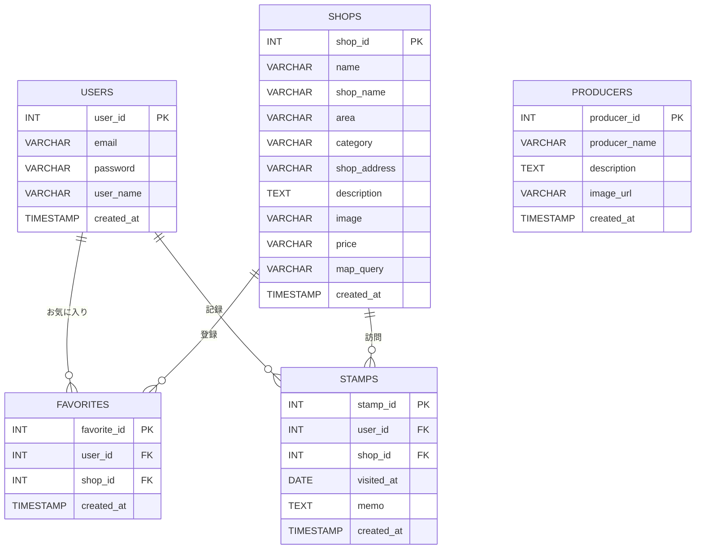

# 十勝和牛ナビ

十勝の和牛を味わえる絶品スポットを手軽に探せるグルメ検索Webアプリケーション

##  アプリケーションの概要
「十勝和牛ナビ」は、北海道・十勝エリアで美味しい和牛を楽しめる飲食店に特化した検索・紹介サービスです。
十勝の豊かな自然で育った和牛の魅力をより多くの人に知ってもらい、ユーザーが現在地や目的に合わせてスムーズに
最高のお店を見つけられるようにサポートします。

##  アプリケーションのURL
本番環境URL: [https://tokachi-wagyu-navi.onrender.com](https://tokachi-wagyu-navi.onrender.com)

## 🛠️ 使用技術（技術スタック）

| カテゴリ | 技術・ツール |
| :--- | :--- |
| **フロントエンド** | JavaScript, Thymeleaf |
| **バックエンド** | Java, Spring Boot, Spring Security |
| **データベース** | H2 Database |
| **インフラ / デプロイ** | Render, Docker |
| **バージョン管理** | Git, GitHub |
| **開発環境** | Gradle |

 ## 💡 開発した背景・動機
実家で和牛を飼育しているというバックグラウンドがあり、日頃から身近にある「美味しい和牛の魅力」をもっと多くの人に知ってもらいたいという想いから、このアプリケーションを開発しました。
十勝エリアの素晴らしい和牛を味わえるお店を、観光客や地元の人たちがより簡単に見つけられるようにしたいと考え、グルメ検索に特化したサービスとして形にしました。

## 🌟 主な機能
* **十勝和牛の飲食店検索**: 十勝エリアで美味しい和牛が食べられるお店を手軽に探せます。
* **詳細情報・マップ連携**: お店のこだわりや位置情報をわかりやすく確認できます。
* **レスポンシブ対応**: スマートフォンやPCなど、どの端末からでも快適に利用可能です。

* ## 📸 画面・機能紹介

### 1. メイン画面（一覧・検索・カレンダー）
十勝の美味しい和牛メニューがずらりと並ぶトップページです。エリア（帯広市・音更町など）ごとの絞り込み検索や、予約・特売日カレンダー機能を使って、気になる情報を手軽にチェックできます。

### 2. 詳細画面（メニュー詳細・アクセスマップ）
お肉のこだわりや価格、食べるお店の情報に加えて、周辺のアクセスマップが確認できる詳細ページです。

### 3. 管理者ログイン画面
管理者が店舗情報やイベント情報を更新するためのログイン画面です。テスト用アカウント情報も記載されており、スムーズに動作確認が行えます。

